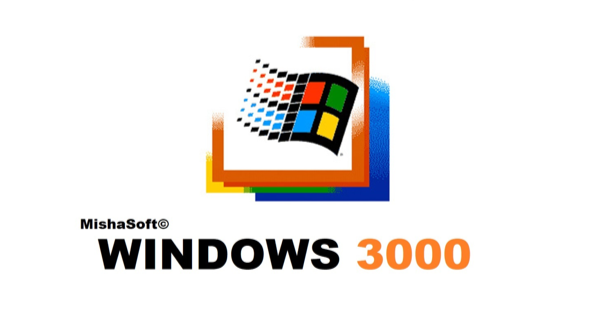

<div align="center">
  
<p align="center">
  
</p>

<br>
<h1>Windows 3000 Enterprise Mega</h1>
<h4>Операционная система (секретная модификация) Windows, созданная в PowerPoint. Система от корпорации MishaSoft Technologies©</h4>
</h4>

[](#)


</div>

<br>

---
>[!WARNING]
>## ‼ Перед запуском программы ознакомьтесь с [EULA.md](https://github.com/2M12/windows3000/blob/main/EULA.md)

> [!CAUTION]
>
> ### ⛔ Дисклеймер
> Настоящая презентация предназначена для развлекательных целей и не имеет отношения к реальным событиям или лицам. Упомянутые в ней персонажи представлены в ироничной, шуточной манере и не отражают действительных характеристик каких‑либо физических лиц.
>
>Автор не имел намерения оскорбить, унизить или каким‑либо образом задеть честь и достоинство третьих лиц. Все совпадения случайны.
>
>В составе презентации присутствуют динамические визуальные эффекты, включая мерцающие элементы. В связи с риском возникновения фотосенситивных реакций лицам с предрасположенностью к эпилептическим приступам просмотр не рекомендуется.

---
## ℹ️ О системе (презентации)

* Я её создавал в **2024-2025 году**, когда познавал и пробовал что-то создавать в программе PowerPoint. Я показывал её много где, но в конечном итоге она лежала просто у меня на диске. И поэтому я принял решение просто выложить её опен-сорс. Можете её **просто скачать и спокойно в ней работать** (достаточно нажать F5).

* В ней **365 слайдов** и **нет VBA-макросов**. Ну и поэтому она весит **108 МБ**.

> [!NOTE]  
>
> ### 🗃 Исторический файл
> Данная ОС не будет обновляться и релизов новых **скорее всего не будет!** Воспринимайте её как исторический файл. Вы можете делать из неё любые форки и использовать примеры в своих презентациях.

---
## 🔍 Возможности (кратко)

| Категория | Описание |
|-----------|----------|
| **Элементы ОС** | Пуск (кроме трея) и другие элементы по типу выключения ПК работают |
| **Браузер** | Интернет Chuchundra имеет вкладки и сайты |
| **Надстройки** | Благодаря надстройкам **была** возможность открывать Википедию и Youtube |
| **Установка** | Перед пользованием ОС вы её сначала ещё и установите |
| **UEFI** | Имеется встроенный UEFI от **Xcomputer** версии v2.0 Revision 5111 |
| **Вредоносное ПО** | Вы можете протестировать 3 вредоносных ПО, которые уничтожат ваш MBR (конечно изолированно в PowerPoint) |
| **Антивирусное ПО** | Благодаря Enterprise Antivirus вы можете спать спокойно |

И многое другое

---

## 📥 Установка

### Способ 1: Готовый .exe

Скачай `Windows3000.pptx` из [Releases](https://github.com/2M12/windows3000/releases) и запусти.

### Способ 2: Из исходников

```bash
git clone https://github.com/2M12/windows3000.git
cd windows3000
start Windows3000.pptx
```

## 🔵 Требования
### Желательно Powerpoint 2016
### Иметь ввиду, что на очень слабых ноутбуках/компьютерах презентация может вылетать

## ☑️ Hash-суммы
```bash
MD5 b3ad3f43cc988b3f05afda6827edf1ed
SHA-256	bf578241d2a3acc75fd2efcca1dc1f84062ba1f8af06df1f6a7f145950b8272e
```
## 📜 Лицензия
MIT © 2026 Mikhail (2M12) / MishaSoft Technologies


